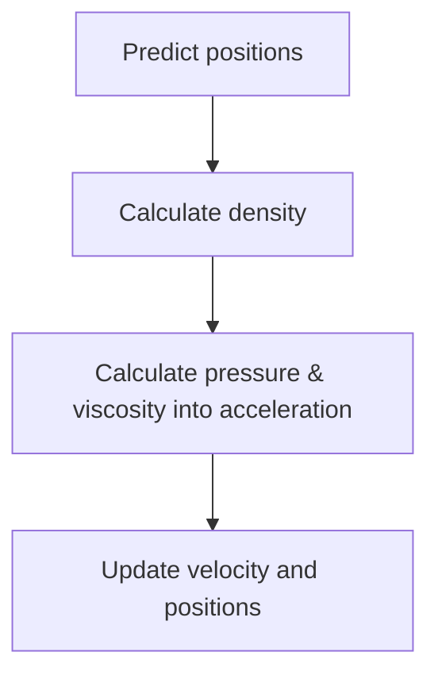

# How kernels affect the behavior of fluid in Smoothed Particle Hydrodynamics

A 2D fluid simulation implemented using Smoothed Particle Hydrodynamics (SPH). This project investigates how different kernel choices for SPH affect fluid stability & convergence, density accuracy and computational cost

## 1. Overview
### Smoothed Particle Hydrodynamics
SPH is a technique of modeling fluids whereby a fluid is characterized by discrete particles. Then, the particles are "blurred" to introduce an in-between, continuous state (in other words, *smoothed*)

The question is, how is one particle blurred? We can imagine a radius around a particle (called the smoothing radius), and depending on the distance, we have a brightness (influence) of that particle on that specific distance. For example:

$$f(r) = (h^2 - r^2)^3$$
where $h$ is the smoothing radius of a particle, and $r$ is the distance from that particle. This function is called a smoothing kernel.

### What this project does

The choice of kernel affects fluid behavior. Density calculation uses $f(r)$, pressure goes from dense regions to less dense regions (and therefore uses $f'(r)$), and viscosity aims to smooth out the velocity field (and therefore uses $f''(r)$)

This project asks how different kernels affect SPH and their tradeoffs to see which choice best fits each use. 

## 2. SPH Implementation
**Note**: More rigorously, $f$ is a function taking in the direction vector and outputs the influence. Since $f$ is usually radially symmetric, it is more simple to think of it as a function of distance, but the text below assumes vector input.

A central equation of SPH is:
$$A(r)=\sum_j m_j\frac{A_j}{\rho_j}f(r - r_j)$$

To put it simply, to get the attribute of a position $r$, we add the influence of each nearby particle with a weight $\frac{m_j \times f(dist)}{\rho_j}$. Therefore, the density of a position is:
$$\rho_i = \sum_j m_jf(r_i-r_j)$$

We try to maintain a rest density $\rho$, and a pressure force tries to correct it:
$$p_i = k(\rho - \rho_i)$$

The pressure force is:
$$f^{pressure}_i = -\nabla p(r_i) = -\sum_j m_j\frac{p_j}{\rho_j}\nabla f(r_i - r_j)$$

This force is, however, not symmetric. To symmetrize:
$$f^{pressure}_i = -\sum_j m_j\frac{p_i + p_j}{2\rho_j}\nabla f(r_i - r_j)$$

And the viscosity:
$$f^{viscosity}_i = \mu\sum_j m_j\frac{v_j - v_i}{\rho_j}\nabla^2 f(r_i - r_j)$$
Basically, with frame of reference particle $i$, it is being accelerated in the direction of the relative speed of its environment. 

With this, we can start simulating a step:

There are some optimizations. For example, the simulation space is separated into boxes of length $h$ so that calculations don't iterate over all particles. 

A step is done each frame, and each step assumes constant time has passed for behavior consistency. For real-time uses, consider accumulating time passed and simulating a dynamic number of steps per frame. 

## 3. Kernels tested
6 kernels are tested.

**Poly6**: $\, f(r) =\alpha (h^2 - r^2)^3$

**SpikyPower2**: $\, f(r) =\alpha (h - r)^2$

**Spiky**: $\, f(r) =\alpha (h - r)^3$

**SpikyNonNegativeViscosity**: $\, f(r) =\alpha (h - r)^3$, but with a custom, positive kernel for viscosity to avoid introducing velocity into the system

**CubicSpline**: $q=\frac{r}{h}$
$$
f(x) = \alpha
\begin{cases}
1 - \frac{3q^2}{2} + \frac{3q^3}{4}, & 0 \leq q < 1 \\
\frac{(2-q)^3}{4}, & 1 \leq q < 2 \\
0, & 2 \leq q
\end{cases}
$$

**WendlandC2**: $q=\frac{r}{h}$
$$
f(x) = \alpha
\begin{cases}
(1-q)^4 \times (1 + 4q), & 0 \leq q \leq 1 \\
0, & 1 < q
\end{cases}
$$

Where $\alpha$ is the normalization factor of a kernel and differs by kernel. It is to assure that:
$$\int f(r) dr = 1$$
Otherwise, even with a high enough $h$, increasing $h$ would change the density at a particle compared to a lower $h$. 

Kernels are compared under these initial arrangements:
- Number of particles $n=1600$ with mass $m=1$. The particles are arranged in a square $40 \times 40$ spaced $0.15$ apart.
- Smoothing radius $h=0.4$ except for **CubicSpline** with $h=0.2$ since its support radius is actually $2h$
- Each frame steps $t=0.02s$ into the future. The predict step is also $0.02s$
- The particles try to maintain a rest density with pressure multiplier $k=40$ and viscosity $\mu=0.5$
- Collisions with the simulation bounds are simplified into a simple translation + damped velocity reflection 

A kernel is stable (settled) when $v_{rms} \leq v$ for a period of time of $3s$. For this project, this also means that the fluid has reached quite a uniform state with low density errors. Each kernel is tested for these metrics:
- **msPerStep**: **SECONDS** per step on average near stabilization. This is due to a typo. 
- **settleSteps**: how many simulation steps it took for this kernel to settle
- **settleDensitySTD**: relative standard deviation of densities when settled, in $\%$
- **settleMaxDensityError**: max relative density error when settled, calculated by $\frac{\max |\rho_i - \rho|}{\rho}$
- **settleMeanDensityError**: mean relative density error when settled, calculated by $\frac{\sum |\rho_i - \rho|}{n\rho}$
- **maxVelocity**: max velocity over the entire simulation.

## 4. Results
There are two scenarios: freeflowing air and dropped fluid

### a. Air
Specific configurations for this scenario:
- Gravity $g=0$
- Target density $\rho=10$
- Settle threshold $v=0.35$

This is a relatively simple experiment to see if each kernel will eventually settle down and reach a uniform state.

Results of `Air0.02.csv` ($t=0.02s$):
| kernel                    |   msPerStep |   settleSteps |   settleDensitySTD |   settleMaxDensityError |   settleMeanDensityError |   maxVelocity |
|:--------------------------|------------:|--------------:|-------------------:|------------------------:|-------------------------:|--------------:|
| SpikyPower2               |     0.00853 |           606 |            0.42228 |                 0.23546 |                  0.196   |       9.16744 |
| Spiky                     |     0.00856 |           708 |            0.05613 |                 1.00052 |                  0.99026 |       7.93773 |
| SpikyNonNegativeViscosity |     0.00779 |           702 |            0.04296 |                 0.99551 |                  0.99011 |       8.51355 |
| CubicSpline               |     0.00628 |           702 |            3.52287 |                 1.27414 |                  0.14054 |       7.92759 |
| WendlandC2                |     0.00569 |           756 |            0.10875 |                 0.40585 |                  0.39381 |       8.50875 |
| Poly6                     |     0.00565 |           882 |            3.68355 |                 0.59555 |                  0.00855 |       7.58753 |

Overall, all kernels performed quite well at this task except for **Poly6**. Although it produced smooth density estimates, the gradient vanishes at $r$ close to $0$, causing low pressure and particles to clump together instead of spreading apart. That explains **Poly6**'s density stdev, and **CubicSpline** settled in a way such that one side was denser than the other and was very slow to resolve. 

Mean density error is explained by the fact that some kernels settle at a state with small holes in their particle configurations. One can try to mitigate this by allowing the air more time to settle at the cost of computation time. Plus, for $\rho=10$, the error is not that significant.

For traditional use (maybe with a shader that blends things together), such small variations aren't dealbreakers. Except for **Poly6**, all would be suitable. If accuracy is preferred, the current problem is that the particle count is too sparse for the simulation bounds, therefore leaving holes. Increasing $n$ to $3025$ and setting $\rho=20$ allows the particles to fill the space much more uniformly, and I was able to measure a mean error of $\leq 0.1$ for **Spiky** variants, though with more computation time.

**Poly6**'s smoothness when approaching $0$ means it is the slowest kernel. On the other hand, **Spiky**s are steep torwards $0$, so particles tend to be very fast and responsive (and sometimes explosive).