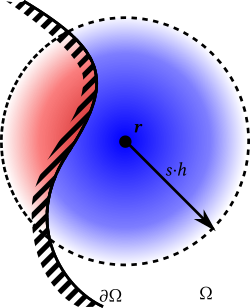
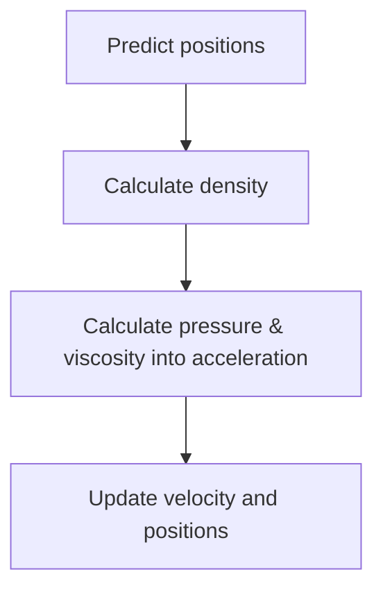
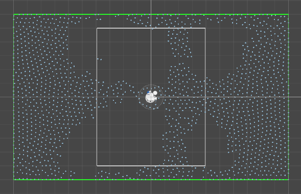
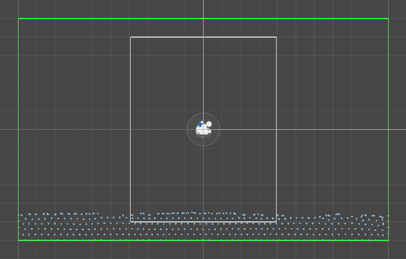
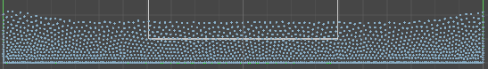
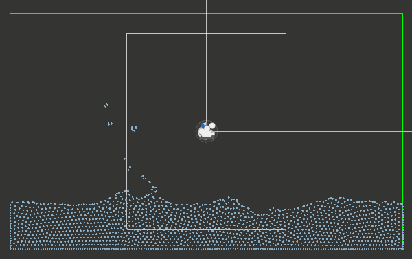
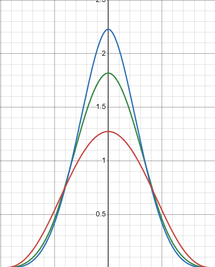
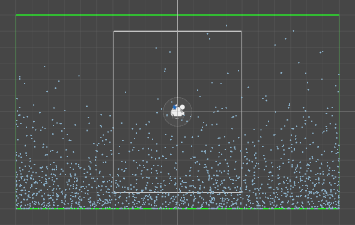
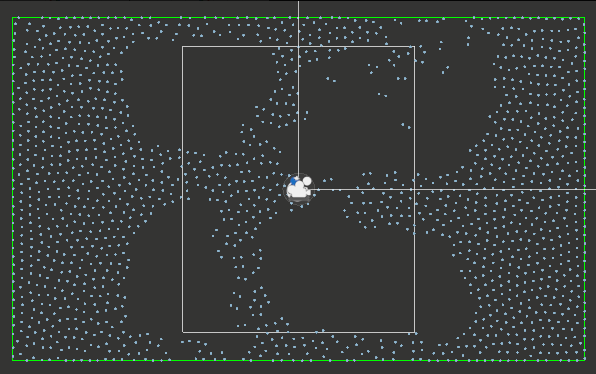

# How kernels affect the behavior of fluid in Smoothed Particle Hydrodynamics

A 2D fluid simulation implemented using Smoothed Particle Hydrodynamics (SPH). This project investigates how different kernel choices for SPH affect fluid stability & convergence, density accuracy and computational cost, determining plausible use cases for these kernels. 

## 1. Overview
### Smoothed Particle Hydrodynamics
SPH is a technique of modeling fluids whereby a fluid is characterized by discrete particles. Then, the particles are "blurred" to introduce an in-between, continuous state (in other words, *smoothed*)

*Figure 1: The blurring of a particle*

The question is, how is one particle blurred? We can imagine a radius around a particle (called the smoothing radius), and depending on the distance, we have a brightness (influence) of that particle on that specific distance. For example:

$$f(r) = (h^2 - r^2)^3$$
where $h$ is the smoothing radius of a particle, and $r$ is the distance from that particle. This function is called a smoothing kernel.

### What this project does

The choice of kernel affects fluid behavior. Density calculation uses $f(r)$, pressure goes from dense regions to less dense regions (and therefore uses $f'(r)$), and viscosity aims to smooth out the velocity field (and therefore uses $f''(r)$)

This project asks how different kernels affect SPH and their tradeoffs to see which choice best fits each use. 

## 2. SPH Implementation
**Note**: More rigorously, $f$ is a function taking in the direction vector and outputs the influence. Since $f$ is usually radially symmetric, it is more simple to think of it as a function of distance. The two definitions can be used interchangably in the text below. 

A central equation of SPH is:
$$A(r)=\sum_j m_j\frac{A_j}{\rho_j}f(r - r_j)$$

To put it simply, to get the attribute of a position $r$, we add the influence of each nearby particle with a weight $\frac{m_j \times f(distance)}{\rho_j}$. Therefore, the density of a position is:
$$\rho_i = \sum_j m_jf(r_i-r_j)$$

We try to maintain a rest density $\rho$, and a pressure force tries to correct it:
$$p_i = k(\rho - \rho_i)$$

The pressure force is:
$$f^{pressure}_i = -\nabla p(r_i) = -\sum_j m_j\frac{p_j}{\rho_j}\nabla f(r_i - r_j)$$

This force is, however, not symmetric. To symmetrize:
$$f^{pressure}_i = -\sum_j m_j\frac{p_i + p_j}{2\rho_j}\nabla f(r_i - r_j)$$

And the viscosity:
$$f^{viscosity}_i = \mu\sum_j m_j\frac{v_j - v_i}{\rho_j}\nabla^2 f(r_i - r_j)$$
Basically, with frame of reference particle $i$, it is being accelerated in the direction of the relative speed of its environment. 

With this, we can start simulating a step:

There are some optimizations. For example, the simulation space is separated into boxes of length $h$ so that calculations don't iterate over all particles. 

A step is done each frame, and each step assumes constant time has passed for behavior consistency. For real-time uses, consider accumulating time passed and simulating a dynamic number of steps per frame. 

## 3. Kernels tested
6 kernels are tested.

**Poly6**: $\, f(r) =\alpha (h^2 - r^2)^3$

**SpikyPower2**: $\, f(r) =\alpha (h - r)^2$

**Spiky**: $\, f(r) =\alpha (h - r)^3$

**SpikyNonNegativeViscosity**: $\, f(r) =\alpha (h - r)^3$, but with a custom, positive kernel for viscosity to avoid introducing velocity into the system

**CubicSpline**: $q=\frac{r}{h}$
$$
f(x) = \alpha
\begin{cases}
1 - \frac{3q^2}{2} + \frac{3q^3}{4}, & 0 \leq q < 1 \\
\frac{(2-q)^3}{4}, & 1 \leq q < 2 \\
0, & 2 \leq q
\end{cases}
$$

**WendlandC2**: $q=\frac{r}{h}$
$$
f(x) = \alpha
\begin{cases}
(1-q)^4 \times (1 + 4q), & 0 \leq q \leq 1 \\
0, & 1 < q
\end{cases}
$$

Where $\alpha$ is the normalization factor of a kernel and differs by kernel. It is to assure that:
$$\int f(r) dr = 1$$
Otherwise, even with a high enough $h$, increasing $h$ would change the density at a particle compared to a lower $h$. 

Kernels are compared under these initial arrangements:
- Number of particles $n=1600$ with mass $m=1$. The particles are arranged in a square $40 \times 40$ spaced $0.15$ apart.
- Smoothing radius $h=0.4$ except for **CubicSpline** with $h=0.2$ since its support radius is actually $2h$
- Each frame steps $dt=0.02s$ into the future. The predict step is also $0.02s$
- The particles try to maintain a rest density with pressure multiplier $k=40$ and viscosity $\mu=0.5$
- Collisions with the simulation bounds are simplified into a simple translation + damped velocity reflection 

A kernel is stable (settled) when $v_{rms} \leq v$ for a period of time of $3s$. For this project, this also means that the fluid has reached quite a uniform state with low density errors. Each kernel is tested for these metrics:
- **msPerStep**: **SECONDS** per step on average near stabilization. This is due to a typo. 
- **settleSteps**: how many simulation steps it took for this kernel to settle
- **settleDensitySTD**: relative standard deviation of densities when settled, in $\%$
- **settleMaxDensityError**: max relative density error when settled, calculated by $\frac{\max |\rho_i - \rho|}{\rho}$
- **settleMeanDensityError**: mean relative density error when settled, calculated by $\frac{\sum |\rho_i - \rho|}{n\rho}$
- **maxVelocity**: max velocity over the entire simulation.

## 4. Results
There are two scenarios: freeflowing air and dropped fluid

### a. Air
Specific configurations for this scenario:
- Gravity $g=0$
- Target density $\rho=10$
- Settle threshold $v=0.35$

This is a relatively simple experiment to see if each kernel will eventually settle down and reach a uniform state.

Results of `Air0.02.csv` ($dt=0.02s$):
| kernel                    |   msPerStep |   settleSteps |   settleDensitySTD |   settleMaxDensityError |   settleMeanDensityError |   maxVelocity |
|:--------------------------|------------:|--------------:|-------------------:|------------------------:|-------------------------:|--------------:|
| SpikyPower2               |     0.00853 |           606 |            0.42228 |                 0.23546 |                  0.196   |       9.16744 |
| Spiky                     |     0.00856 |           708 |            0.05613 |                 1.00052 |                  0.99026 |       7.93773 |
| SpikyNonNegativeViscosity |     0.00779 |           702 |            0.04296 |                 0.99551 |                  0.99011 |       8.51355 |
| CubicSpline               |     0.00628 |           702 |            3.52287 |                 1.27414 |                  0.14054 |       7.92759 |
| WendlandC2                |     0.00569 |           756 |            0.10875 |                 0.40585 |                  0.39381 |       8.50875 |
| Poly6                     |     0.00565 |           882 |            3.68355 |                 0.59555 |                  0.00855 |       7.58753 |

Overall, all kernels performed quite well at this task except for **Poly6**. Although it produced smooth density estimates, the gradient vanishes at $r$ close to $0$, causing low pressure and particles to clump together instead of spreading apart. That explains **Poly6**'s density **settleDensitySTD**, and **CubicSpline** settled in a way such that one side was denser than the other and was very slow to resolve. 

*Figure 2: Poly6's final state*

Mean density error is explained by the fact that some kernels settle at a state with small holes in their particle configurations. One can try to mitigate this by allowing the air more time to settle at the cost of computation time. Plus, for $\rho=10$, the error is not that significant.

For traditional use (maybe with a shader that blends things together), such small variations aren't dealbreakers. Except for **Poly6**, all would be suitable. If accuracy is preferred, the current problem is that the particle count is too sparse for the simulation bounds, therefore leaving holes. Increasing $n$ to $3025$ and setting $\rho=20$ allows the particles to fill the space much more uniformly, and I was able to measure a mean error of $\leq 0.1$ for **Spiky** variants, though with more computation time.

**Poly6**'s smoothness when approaching $0$ means it is the slowest kernel. On the other hand, **Spiky**s are steep torwards $0$, so particles tend to be very fast and responsive (and sometimes explosive). 

**Poly6**'s use of $r^2$ also means the computation doesn't need to square root the distance, theoretically saving computation time for density calculations. However I don't find much of a difference even with $n=10000$. It is surprising how **Spiky**s seem to take the most time compared to **CubicSpline** and **WendlandC2** even though **CubicSpline** also needs a $\sqrt{}$ operation and has one more `if` statement.

### b. Fluid
#### Overall behavior
Specific configurations for this scenario:
- Gravity $g=10$
- Target density $\rho=25$
- Settle threshold $v=0.65$

Fluid will be dropped and settle at the bottom. We measure metrics on the stabilization behavior of each kernel given a chaotic initial state.

Results of `Fluid0.02.csv`:
| kernel                    |   msPerStep |   settleSteps |   settleDensitySTD |   settleMaxDensityError |   settleMeanDensityError |   maxVelocity |
|:--------------------------|------------:|--------------:|-------------------:|------------------------:|-------------------------:|--------------:|
| SpikyNonNegativeViscosity |     0.02323 |           720 |            24.6142 |                 2.15491 |                  0.99648 |       13.4754 |
| SpikyPower2               |     0.02195 |           726 |            26.3461 |                 2.03652 |                  0.87711 |       14.0056 |
| Spiky                     |     0.02399 |           726 |            24.6942 |                 2.06978 |                  0.98631 |       40.4287 |
| CubicSpline               |     0.02322 |           588 |            30.0363 |                 3.21126 |                  0.85109 |       12.7304 |
| WendlandC2                |     0.01622 |           726 |            27.5017 |                 2.71221 |                  0.8264  |       13.8732 |
| Poly6                     |     0.0166  |           438 |            39.0713 |                 2.96113 |                  1.01158 |       13.924  |

**msPerStep** is noticably higher as particles clump together more to achieve $\rho=25$, causing the average neighbors of a particle to increase. 

The steps to settle are also comparable to `Air0.02.csv` except for our outlier here **Poly6**. Under gravity, **Poly6**'s gradient gives up and particles ultimately merge into clumps separated by $h$. While this may not be accurate, this makes **Poly6** efficient to settle and may also explain its lower **msPerStep**. Importantly, the fluid still retains its general shape and exhibits convincing behavior when disregarding individual particles. Therefore **Poly6** is quite suitable for real-time uses combined with an algorithm that renders the fluid as one big shape (a shader or marching cubes for example). Unfortunately, **Poly6** suffers in accuracy because of this behavior. 

*Figure 3: Poly6's final state fluid*

One notable result is the insane density relative standard deviation of each kernel. 

*Figure 4: Fluid's compressibility*

This is due to the fluid being compressed at the bottom to support the weight of the fluid. The way to solve this is to increase the pressure multiplier $k$ so that each particle has a stronger push force, enforcing near imcompressibility. 

This approach comes with a drawback of course. The simulation easily becomes unstable at $dt=0.02$, so we need finer steps for stable behavior. Use this approach when trying to maximize realism. 

Results of `FluidStrong0.01.csv`, tested at $k=200$ and $dt=0.01$:
| kernel                    |   settleSteps |   settleDensitySTD |   settleMaxDensityError |   settleMeanDensityError |   maxVelocity |
|:--------------------------|--------------:|-------------------:|------------------------:|-------------------------:|--------------:|
| SpikyNonNegativeViscosity |          1560 |           11.1579  |                 0.54635 |                  0.27522 |       16.7738 |
| Poly6                     |           852 |           12.9695  |                 0.9827  |                  0.18069 |       19.6091 |
| SpikyPower2               |          1590 |            8.9076  |                 0.43166 |                  0.19131 |      163.446  |
| Spiky                     |          1368 |           11.1359  |                 0.54551 |                  0.27518 |       16.3676 |
| CubicSpline               |          1650 |            9.39093 |                 0.57284 |                  0.16622 |       19.2703 |
| WendlandC2                |          1860 |            9.32416 |                 0.46608 |                  0.1787  |       18.591  |

The results are much more accurate physically, at the cost of time. Kernels need roughly double the number of frames to settle, but density metrics look much more promising compared to `Fluid0.02.csv`. One can go even further with increasing $k$ and taking even finer steps.

*Figure 5: What fluid looks like with a strong multiplier*

Back to `Fluid0.02.csv`, **settleDensitySTD** is bad, but **CubicSpline** and **WendlandC2** have it worse than **Spiky**s (also true for **settleMaxDensityError**). The two kernels as well as **Poly6** suffer from a vanishing gradient to ensure smoothness, differing by the extent. **Poly6** is very smooth, **CubicSpline** is sharper and **WendlandC2** is the sharpest nearing $r=0$. So **CubicSpline** exhibits slight clumping as well, and **WendlandC2** is sharp enough that such clumping is visually indistinct (though the metrics prove it exists). Doing a lot of tests, the max velocities of **CubicSpline** and **WendlandC2** also tend not to explode. This makes these kernels some of the most well-rounded and suitable for a lot of use cases, as they can maintain a smooth density field by having a smooth top while not suffering too much from a vanishing gradient.

*Figure 6: Graphs of Poly6, CubicSpline and WendlandC2, in order of RGB*

On the topic of **maxVelocity**, what's up with **Spiky**'s $40.4287$ and **SpikyPower2**'s $163.446$? Viscosity is calculated on the laplacian of each kernel, and it turns out that **Spiky** and **SpikyPower2** can have a negative laplacian, introducing sudden velocity into the simulation. With gravity applied, particles accumulate at the bottom and may get very close to one another, causing some particles to explode and reach unrealistic speeds. **SpikyNonNegativeViscosity** fixes this by having a custom kernel used only for viscosity that's positive at every distance. Aside from this artifact, **Spiky** is useful for a consistently responsive simulation as the gradient is meaningful at every point, though it doesn't produce a smooth density field since the function isn't smooth at $r=0$. **SpikyNonNegativeViscosity** fixes exploding particles while slightly altering behavior.

The thing is, all kernels actually have a region within its radius where the laplacian is negative, so why are **Spiky**s more extreme than others? As it turns out, **Spiky**s have divergent laplacian approaching $r=0$, while other functions' laplacians towards $r=0$ reach a limit. 

This has to do with the smoothness of the kernel chosen. The laplacian involves the term $\frac{f'(r)}{r}$. For smooth functions, $\lim_{r\to0}f'(r)=0$, so the numerator vanishes along with the denominator. The limit of the laplacian can be calculated with L'Hôpital's rule. For **Spiky**s however, $f'(0)$ is still meaningful, causing the laplacian to shoot off to $\infty$.

#### Extreme cases

___
##### Larger $dt$

Now that we have established the behavior and probable use cases of each kernel, here's some more benchmarking:

$dt=0.02$ is chosen for testing due to its balance between physical stability and performance. However, we can make the simulation even faster by increasing $dt$.

Results of `Fluid0.03.csv` (note that settle time is $3.06s$ due to imperfect rounding). The format is `Fluid0.02.csv -> Fluid0.03.csv`:
| kernel                    | settleSteps   | settleDensitySTD     | settleMaxDensityError   | settleMeanDensityError   | maxVelocity          |
|:--------------------------|:--------------|:---------------------|:------------------------|:-------------------------|:---------------------|
| CubicSpline               | 588 -> 396.0  | 30.03627 -> 31.66046 | 3.21126 -> 3.23171      | 0.85109 -> 0.87527       | 12.73043 -> 17.26475 |
| Poly6                     | 438 -> NaN    | 39.07129 -> NaN      | 2.96113 -> NaN          | 1.01158 -> NaN           | 13.92401 -> NaN      |
| Spiky                     | 726 -> 384.0  | 24.6942 -> 25.32232  | 2.06978 -> 1.97278      | 0.98631 -> 1.04623       | 40.42869 -> 20.9439  |
| SpikyNonNegativeViscosity | 720 -> 396.0  | 24.61423 -> 27.23494 | 2.15491 -> 2.12639      | 0.99648 -> 0.99058       | 13.47544 -> 15.69884 |
| SpikyPower2               | 726 -> 486.0  | 26.34606 -> 26.17385 | 2.03652 -> 1.8562       | 0.87711 -> 0.87709       | 14.00561 -> 19.26917 |
| WendlandC2                | 726 -> 396.0  | 27.5017 -> 28.32117  | 2.71221 -> 1.943        | 0.8264 -> 0.8788         | 13.87324 -> 18.53333 |

Immediately we don't see **Poly6** making an appearance. With $dt=0.03$, particles jitter, especially at the bottom bound of the simulation, causing $v_{rms}$ to never go below $0.65$ for long enough. 

For other kernels, the densities remain relatively similar, and due to the larger timestep, **maxVelocity** is higher. So what's the limit?

Results of `Fluid0.04.csv` (settle duration $3.12s$):
| kernel      |   settleSteps |   settleDensitySTD |   settleMaxDensityError |   settleMeanDensityError |   maxVelocity |
|:------------|--------------:|-------------------:|------------------------:|-------------------------:|--------------:|
| SpikyPower2 |           288 |            26.6801 |                 1.86311 |                  0.86781 |        26.911 |

Other kernels were extremely unstable (for example $v_{rms} \geq 7$ for **Spiky**). Only **SpikyPower2** stabilized, maintaining an impressive density error comparable to $dt=0.02$ when settled, but it struggled at first. 

*Figure 7: Explosive fluid due to high deltaTime*

An interesting thing to point out is how different kernels react to increasing $dt$. **Spiky** and **WendlandC2** have $v_{rms}$ consistently around $7$. **CubicSpline** did form a liquid body but whose behavior resembles boiling water ($v_{rms}$ around $5$). And **Poly6**'s vanishing gradient meant it dealt very well with a high $dt$. While it of course formed clumps and jittered, the fluid shape was quite stable and $v_{rms}$ was only around $1$.

We see a tradeoff here. Fluid responsiveness corresponds with a sharp function, but that sharpness can cause explosive behavior at high time steps. Depending on the use case, this needs to be considered, especially when $dt$ is dynamic. Choose an appropriate kernel and clamp $dt$ when needed. 
___
##### Larger drop
With simulation bound $10\times6$, the drop is only $3$ units on average. For this experiment, the bound is increased to $10\times15$, and the fluid is dropped with offset $11$ from $(0,0)$. Therefore, the fluid drops, on average, $18.5$ units before touching the ground. 

Results of `FluidHigh0.02.csv` compared to `Fluid0.02.csv`:
| kernel                    | settleSteps   | maxVelocity          |
|:--------------------------|:--------------|:---------------------|
| CubicSpline               | 588 -> 648    | 12.73043 -> 26.24673 |
| Poly6                     | 438 -> 516    | 13.92401 -> 26.21604 |
| Spiky                     | 726 -> 720    | 40.42869 -> 29.00913 |
| SpikyNonNegativeViscosity | 720 -> 708    | 13.47544 -> 25.43469 |
| SpikyPower2               | 726 -> 654    | 14.00561 -> 544.0333 |
| WendlandC2                | 726 -> 774    | 13.87324 -> 26.23156 |

**SpikyNonNegativeViscosity** definitely doesn't have negative viscosity, so we can use that as a baseline. The **maxVelocity** of **Spiky** notably went down, showing that speed artifacts are quite dependent on the initial configurations. **SpikyPower2**, however, jumped all the way to $544.0333$. The simulation didn't exactly blow up, though; rather, a few ill particles reached relativistic speed whose velocities are measured. 

Other than that, **settleSteps** didn't alter by a lot. In fact, some of them went down. 

### c. Mixed kernel
We were able to get away with a custom laplacian for **SpikyNonNegativeViscosity**, though it is not physically accurate to the kernel. Disregarding physics for a second, we can take this a step further and use a custom gradient as well. 

This is the idea of a mixed kernel, where different components are mix-and-matched for density, pressure and viscosity. Of course, this means that the fluid doesn't move accurately to the density field, sacrifising physical fidelity for unmatched flexibility. With a good combination of kernels, the fluid may still behave convincingly to the eyes, making this approach suitable for performance-oriented or visual-oriented uses. 

The **Mixed** kernel below uses **Poly6** for density calculations to ensure a smooth density field, **Spiky** for gradient calculations for a responsive pressure field, and a custom linear function for the laplacian that's positive everywhere (similar to **SpikyNonNegativeViscosity**). 

#### Air
Using **Poly6** for density means that at the same $\rho$, the fluid seems to need more particles to reach $\rho$ than compared to **Spiky** for example.

This result is measured at $\rho=5$
| kernel   |   settleSteps |   settleDensitySTD |   settleMaxDensityError |   settleMeanDensityError |   maxVelocity |
|:---------|--------------:|-------------------:|------------------------:|-------------------------:|--------------:|
| Mixed    |           582 |            0.24381 |                 1.02906 |                  0.99212 |       10.3867 |

Note that **settleMaxDensityError** and **settleMeanDensityError** are divided by $\rho$, so the lower $\rho$ is, the higher the results tend to be. 

This result is pretty good! I am not used to **Poly6** being this responsive. And the fluid was able to finally settle uniformly. $\rho$ did need to decrease for this, as $\rho=10$ means the fluid would have holes. 

*Figure 8: Mixed producing holes*

That looks like **Poly6**. This made me curious, and I tested **Poly6** at $\rho=5$.
| kernel   |   settleSteps |   settleDensitySTD |   settleMaxDensityError |   settleMeanDensityError |   maxVelocity |
|:---------|--------------:|-------------------:|------------------------:|-------------------------:|--------------:|
| Poly6    |           636 |           10.4911  |                 3.77475 |                  0.60482 |       10.5701 |

So it's clear that the sharper curve for gradient calculations did help the simulation stabilize faster and more uniformly. 

#### Fluid
| file                    |   settleSteps |   settleDensitySTD |   settleMaxDensityError |   settleMeanDensityError |   maxVelocity |
|:--------------------------|--------------:|-------------------:|------------------------:|-------------------------:|--------------:|
| Fluid0.02.csv                     |           720 |            22.7498 |                 1.67149 |                  0.75207 |       16.2979 |
| FluidStrong0.01.csv                     |          1626 |            8.09792 |                 0.43452 |                  0.16565 |       19.1617 |
| FluidHigh0.02.csv                     |           642 |            23.8979 |                 1.80401 |                  0.73437 |       26.9791 |
| Fluid0.03.csv                     |           390 |            23.4022 |                 1.71695 |                  0.78016 |       18.884  |

These are promising numbers. **Poly6**'s smooth density field works with **Spiky**'s sharpness, allowing the fluid to reach the desired state quickly. And a custom laplacian ensures the kernel doesn't suffer from speed artifacts. 

The behavior of the fluid is different from **Spiky** under these combinations. This can be observed using mouse interactions. In many ways, it is similar to **WendlandC2**, which is relatively sharp but still has a smooth density field. 

So a mixed kernel can be pretty well-rounded as well if the use case doesn't ask for absolute physical accuracy. Depending on the constraint that a kernel may be chosen for performance or visual effects. 